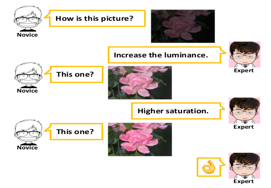
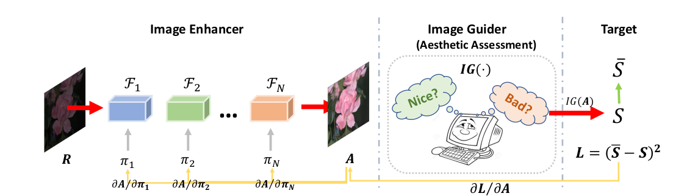
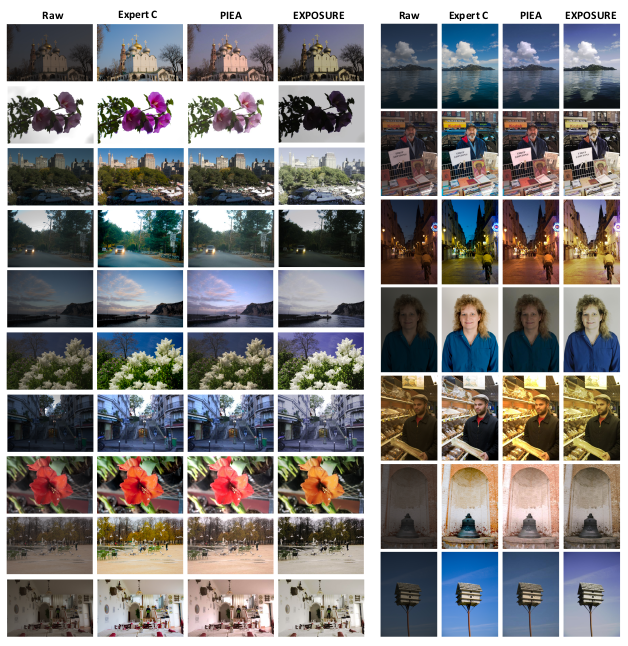

# PIEA

# Progressive Image Enhancement under Aesthetic Guidance

**P**rogressive-**I**mage **E**nhancement under  **A**esthetic Guidance (PIEA), A novel progressive image enhancement framework, which enhances the raw images in a progressive fashion
under aesthetic guidance. The introducing of the aesthetic model
promotes the improvement of image enhancement via abundant aes-
thetic dataset and reduces the bias caused by human personalized
preferences. The progressive enhancing strategy makes the enhanc-
ing process easy-to-understand. With the plug & play setting, PIEA
is free of any training process for learning parameters, which miti-
gates the requirements of costly paired data. The experiments on
FiveK datasets show that PIEA outperforms the state-of-the-art
methods. In the future, we will explore a better way to update filter
parameters more efficiently and improve the aesthetic assessment
models to adapt to the weak images.

This our official implementation for the [paper](http://bio.duxy.me/papers/ICMR2019-PIEA.pdf):

> Xiaoyu Du, Xun Yang, Zhiguang Qin, Jinhui Tang, **Progressive Image Enhancement under Aesthetic Guidance**, in ICMR ’19, June 10–13, 2019, Ottawa, ON, Canada.

* The basic concept is: given a expert, improve the image by the feedback from the expert. 


* The achitecture


* Samples


If you use the codes, please cite the paper. Thanks!

This codes are implemented by [@duxy-me](https://github.com/duxy-me) and [@lshdan](https://github.com/lshdan). The implementations of filters are from [@yuanming-hu](https://github.com/yuanming-hu/exposure)

## Setup 

1. Download weights

```bash
mkdir -p weights

curl -o weights/mobilenet_weights.h5 https://github.com/lshdan/piea/releases/download/1.0/mobilenet_weights.h5

curl -o weights/inception_resnet_weights.h5 https://github.com/lshdan/piea/releases/download/1.0/inception_resnet_weights.h5
```

2. Build environment ([docker](https://docs.docker.com/engine/install/ubuntu/) is required)

```bash
make build
```

## Run the demo

- CPU version:

```bash

make run-piea-cpu 

```

- GPU version: ([docker with nvidia runtime](https://github.com/NVIDIA/nvidia-docker) required)

```bash

make run-piea-gpu 

```
